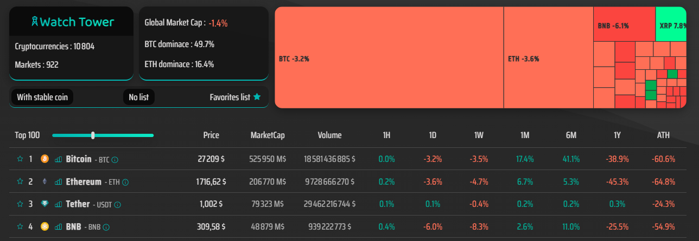

# Crypto Watch Tower


## Presentation

The crypto Watch Tower is the app centralizing up to date crypto currencies global market data from CoinGenko API: `https://www.coingecko.com/`



## Live demo of Crypto Watch Tower app is available on [here](https://crypto-dashboard-ruby.vercel.app/)

## Local setup

1. Clone and/or fork this repository.
2. Then, run the development server:

```bash
npm run dev
# or
yarn dev
# or
pnpm dev
```

3. Open [http://localhost:3000](http://localhost:3000) with your browser to see the result.

### Prerequisites


